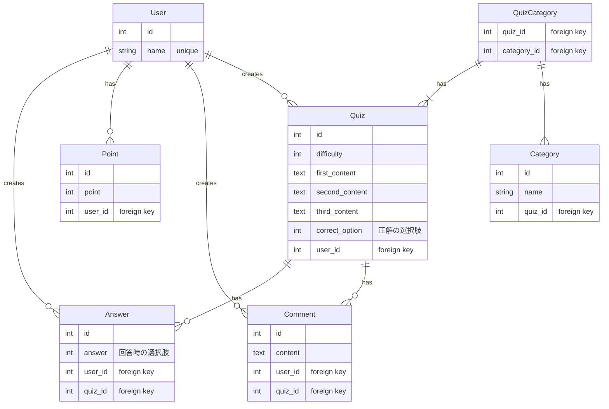

```mermaid
erDiagram
  User ||--o{ Answer : creates
  User ||--o{ Point : has
  User ||--o{ Comment : creates
  User ||--o{ Quiz : creates

  Quiz ||--o{ Answer : has
  Quiz ||--o{ Comment : has

  QuizCategory ||--|{ Quiz :has
  QuizCategory ||--|{ Category : has

  User {
    int id
    string name "unique"
  }

  Quiz {
    int id
    int difficulty
    text first_content
    text second_content
    text third_content
    int correct_option "正解の選択肢"
    int user_id "foreign key"
  }

  Answer {
    int id
    int answer "回答時の選択肢"
    int user_id "foreign key"
    int quiz_id "foreign key"
  }

  Point {
    int id
    int point
    int user_id "foreign key"
  }

  Comment {
    int id
    text content
    int user_id "foreign key"
    int quiz_id "foreign key"
  }

  Category {
    int id
    string name
    int quiz_id "foreign key"
  }

  QuizCategory {
    int quiz_id "foreign key"
    int category_id "foreign key"

  }
```

# 補足
- ユーザー認証はGoogleを連携予定のため、メールアドレスやパスワードは持たない
- 問題を作るときは必ず3つの選択肢が必要なので、1:n(0<n)にしている
- 問題は複数のタグをつけることができるので、多対多
- 他は必ずしも持つ必要がないので、1:多にしている