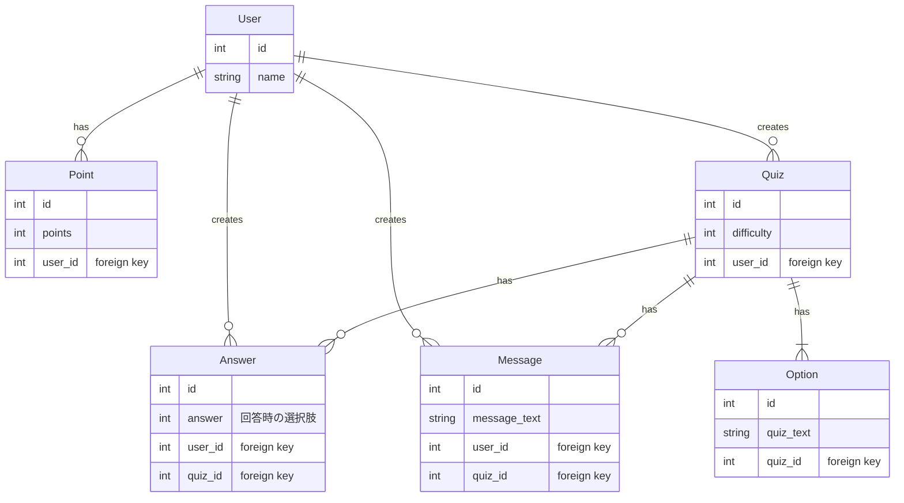

```mermaid
erDiagram
  User ||--o{ Answer : creates
  User ||--o{ Point : has
  User ||--o{ Message : creates
  User ||--o{ Quiz : creates

  Quiz ||--o{ Answer : has
  Quiz ||--o{ Message : has
  Quiz ||--|{ Option : has

  User {
    int id
    string name
  }

  Quiz {
    int id
    int difficulty
    int user_id "foreign key"
  }

  Option {
    int id
    string quiz_text
    int quiz_id "foreign key"
  }

  Answer {
    int id
    int answer "回答時の選択肢"
    int user_id "foreign key"
    int quiz_id "foreign key"
  }

  Point {
    int id
    int points
    int user_id "foreign key"
  }

  Message {
    int id
    string message_text
    int user_id "foreign key"
    int quiz_id "foreign key"
  }
```

# 補足
- Quizは選択肢を3つ持つ大枠のテーブル
- 各選択肢がOption
- そのためMessageやAnswerはquizに紐付く
- ユーザー認証はGoogleを連携予定のため、メールアドレスやパスワードは持たない
- 問題を作るときは必ず3つの選択肢が必要なので、1:n(0<n)にしている
- 他は必ずしも持つ必要がないので、1:多にしている